# Reporting-tasks-project
## Using this technologies:
* Web api
* My sql
* PHP
* WinForms
* Angular
## install the app:
  1. Run the `ReportingTasksProject` project.(the web api one)  This is the server.

  2.  Run the `php` server by 
        ```sh 
        shift+f6
        ```
        on the index.php page

  3. Run `ng serve` for a dev server, if you want to run the angular project. Navigate to `http://localhost:4200/`. 
      shoose which server you want to: the web api or the php one. 
      you can choose it in the `global` page
  4. Run the winform project  
  5. [Run the `mySql` code](https://) 

   * important thing in order to `send email` ip php platporm you have to change afew thing in the xampp files 
     in "C:\xampp\php\php.ini" find [mail function] and change 
     ```sh
       SMTP=smtp.gmail.com
       smtp_port=587
       sendmail_from = my-gmail-id@gmail.com
       sendmail_path = "\"C:\xampp\sendmail\sendmail.exe\" -t"
       ```
       now Open C:\xampp\sendmail\sendmail.ini. Replace all the existing code in sendmail.ini with following code
       ```sh
       [sendmail]   
       smtp_server=smtp.gmail.com
       smtp_port=587
       error_logfile=error.log
       debug_logfile=debug.log
       auth_username=my-gmail-id@gmail.com
       auth_password=my-gmail-password
       force_sender=my-gmail-id@gmail.com
       ```
       PS: don't forgot to replace my-gmail-id and my-gmail-password in above code.
       Also remember to restart the server using the XAMMP control panel so the changes take effect.
## Using libraries
   * in angular platform we use:
     * [primeng](https://www.primefaces.org/primeng/#/setup)
     * [bootsrap](https://getbootstrap.com/docs/3.3/getting-started/)
   * in winform platform we use:
     * [Teleric](https://docs.telerik.com/devtools/winforms/getting-started)  

## System diagram:

***
## Web api
### Models
* User:
    * UserId - int, requiered,unique, identity
    * UserName - string - minLength: 2, maxLength:10, reqiered
    * UserEmail - string - pattern:email pattern, reqiered
    * Password - string -  minLength: 6, maxLength:10, reqiered
    * TeamLeaderId -int, optional
    * UserKindId-int,requiered
    *  UserIP- string,optional
    *  VerifyPassword- string,optional
* UserKind:
    * KindUserId - int, requiered,unique, identity
    * KindUserName - string, requiered,
 * Access:
    * AccessId - int, requiered,unique, identity
    * AccessName - string, reqiered
* UserKindToAccess:
    * UserKindToAccessId - int, requiered,unique, identity
    * userKindId - int, requiered
    * AccessId - int, requiered
* Projects:
    * ProjectId - int, requiered,unique, identity
    * ProjectName - string,reqiered
    * ClientName - string,reqiered
    * TeamLeaderId- int reqiered
    * DevelopersHours -int,reqiered
    * QaHours -int,reqiered
    * Ui/UxHours -int,reqiered 
    * StartDate -date,reqiered 
    * FinishDate -date,reqiered 
    * IsActive-boolean defult true
 * WorkerToProject:
    * WorkerToProjectId - int, requiered,unique, identity
    * UserId - int, requiered
    * ProjectId - int, requiered 
    * Hours - int, requiered 
 * ActualHours:
    * ActualHoursId - int, requiered,unique, identity
    * UserId - int, requiered
    * ProjectId - int, requiered 
    * CountHours - double, requiered 
    * date - date, requiered
*  Unknown:
   * Id -int,optional
   *  Name -string,requierd
   * Date-date optional
   * Hours -double
   * allocatedHours-double
* DetailsWorkerInProjects:
   * UserId-int 
   *   TeamLeaderName-string
   *   Name-string 
   *   Kind-string 
   *   Hours -int
   *   List<ActualHours> ActualHours-list of actualHours
* TreeTable:
   * Project-Project
   * DetailsWorkerInProjects- List<DetailsWorkerInProjects>  
### Controllers
* User controller:
    * Get -getAllUsers.
         We will return all the users from the db.
    * Get -GetUsersForTeamLeader.
      requierd data: 
         * TeamLeaderId 
         We will return all the matching users from the db.
    * Get -GetTeamLeaders.
         We will return all the matching users from the db.
     * Get -VerifyEmail.
      requierd data: 
         * userName 
         * password
         We will check if the user is exists with the same password if valid we will return the user,Else - we will return a matching error 
    * Get -VerifyPassword.
      requierd data: 
         * userName 
         We will check if the user is exists and send him an email
    * Post - Register.    
         requierd data: 
           * User
    If the user is valid - we will add him to the db, and return true, Else - we will return a matching error
    * Get - Login.
         requierd data: 
           * UserName 
           * Password 
     If the user whith the UserName and Password is exist in the db we will return the UserId object, Else - we will return not found.
    * Get - GetUserById.
         requierd data: 
           * UserId
    If there is in the db user with this UserId ,we will return the user object ,Else we will return not found.
    * Put - update user
         requierd data: 
         * User
     If there is in the db user object whith the same user_id and the new user object is valid - we will update the user in the db to this user, Else - we will return matching error.
    * Put - EditPassword
         requierd data: 
         * User
     If there is in the db user object whith the same user_id and the new user object is valid - we will update the user in the db to this user, Else - we will return matching error.
    * Put - CheckUserIp
         requierd data: 
         * Ip
     If there is in the db user object whith the same user_ip - we will return the user, Else - we will return matching error.
    * Delete - remove user
         requierd data: 
        * UserId
    If a user with this UserId is exist in the db - we will dellete him, Else we will return matching error.
    
   
* UserKind controller:
    * Get - get all the user kinds  
      We will return all the users kinds from the db.
* Access controller:
    * Get - get all the access
     We will return all the access from the db.

* AccessToUserKind controller:
    * Get - get access by UserKindId
        requierd data: 
        * UserKindId
    If the UserKindId is exist in the db - we will return all the access that belong to this user kind, Else - return matching error.

* Project controller:
    * Get - get all Projects
      We will return all the projects that exist in the db.
    * Get - Get Active Projects
      We will return all the matching projects
     * Get - GetProjectsByTeamId
       requierd data: 
         * TeamLeaderId 
      We will return all the matching projects
    * Get - GetProjectsByUserId
       requierd data: 
         * UserId 
      We will return all the matching projects
    * Get - GetProjectsAndHoursByUserId
       requierd data: 
         * UserId 
      We will return all the matching projects and the hours to this project
    * Get - GetProjectsAndHoursByUserIdAccordingTheMonth
       requierd data: 
         * UserId 
      We will return all the matching projects and the hours to this project
    * Get - GetProjectsAndHoursByTeamLeaderId
       requierd data: 
         * TeamId 
      We will return all the matching projects and the hours to this project
    * Post - add project    
         requierd data: 
        * Project
        * currentUserId
       If the user that his id equal to the currentUserId has the access to add new project, and the project id valid - we will add the new project to the db, Else - we will    return a matching error.

    * Put - update project
         requierd data: 
         * Project
         * currentUserId
         
    If the user that his id equal to the currentUserId has the accessto update  projects, and a project with the same id to the project date is found, we will update this project to the new project object, Else - we will return matching error.
    * Delete 
         requierd data: 
          * ProjectId
    If there is the db project with id that equals ProjectId - we will delete it from the db, Else - we will return matching error.
* Hours controller:
    
    * Post - add 
        requierd data: 
           * ActualHours (object)
     If the ActualHours object is valid, we will add it to the db, Else we will return matchig error.

* TreeTable controller:
  * Get - get all Tree Table
      We will return all the Tree Table that exist 
      this will return data for the reports.
* WorkerToProject controller:
    * Get - get projects by UserId
        requierd data: 
           * UserId
       We will return all the projects that belong to the User with id UserId or matching error.
    * Get - get workers by projectId
        requierd data: 
           * ProjectId
       We will return all the workers that belong to the project with id ProjectId or matching error.
    * Get - GetWorkerToProjectByPidAndUid
        requierd data: 
           * ProjectId
           * UserId
       We will return all the workers that belong to the project with id ProjectId and UserId or matching error.
    * Get - get all workers      
       We will return all the workers in the db.
    * Post - add new worker to project
        requierd data: 
           * WorkerToProject (object)
       If the WorkerToProject object is valid, we will add it to the db, Else we will return matchig error.
    * Put - updete details of worker to project record .
         requierd data: 
         * WorkerToProject
         * currentUserId
    If the user that his id equal to the currentUserId has the access to update  WorkerToProject records, and a WorkerToProject with the same id to the WorkerToProject id is found, we will update this WorkerToProject to the new WorkerToProject object, Else - we will return matching error.
    * Delete
        requierd data: 
        * WorkerToProjectId
        * currentUserId
    If the user that his id equal to the currentUserId has the access to delete  WorkerToProject records, and a WorkerToProject with the same id to the WorkerToProject id is found, we will delete this WorkerToProject from the db, Else - we will return matching error.
* SendEmail controller:
   * Get -send email     
***
## WinForms + Angular: Screenshots
### Entering screenshots:
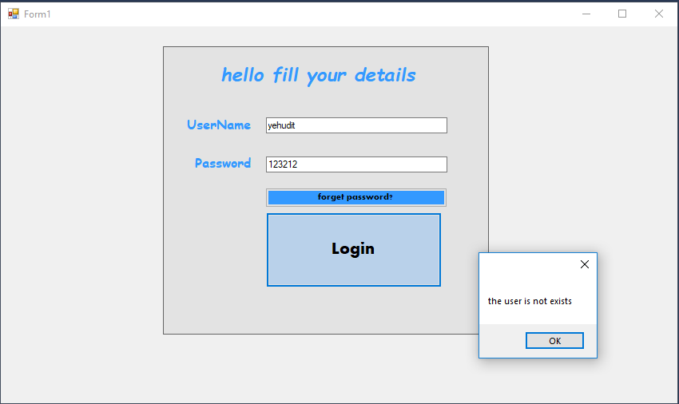   
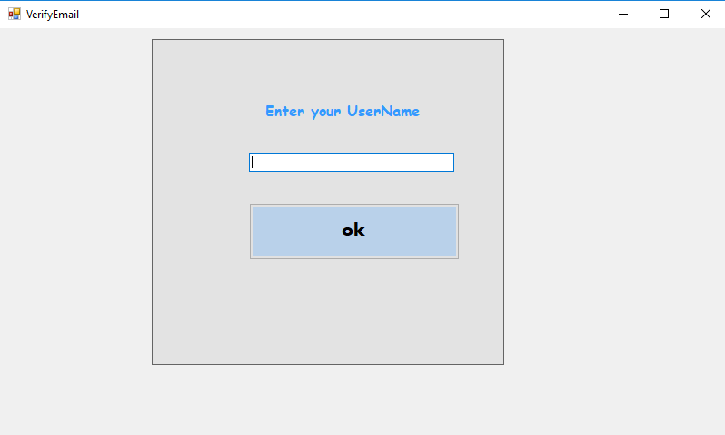   
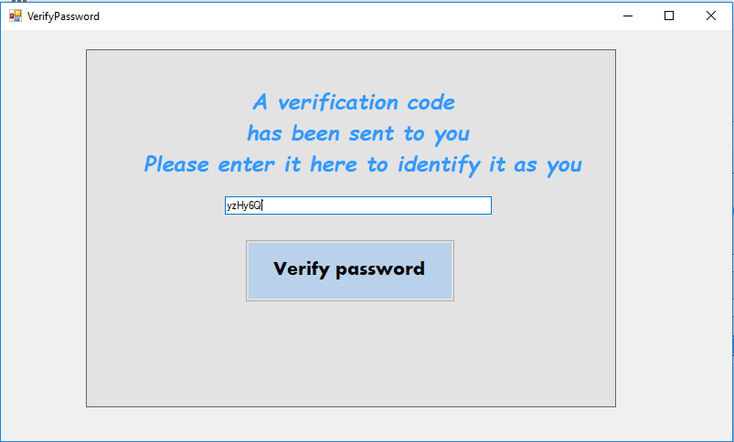   
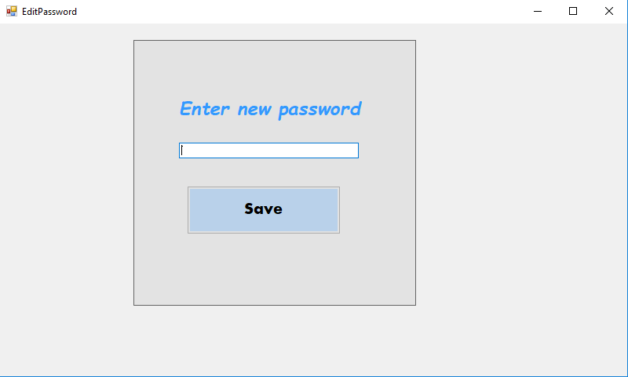   
### Manager screenshots:
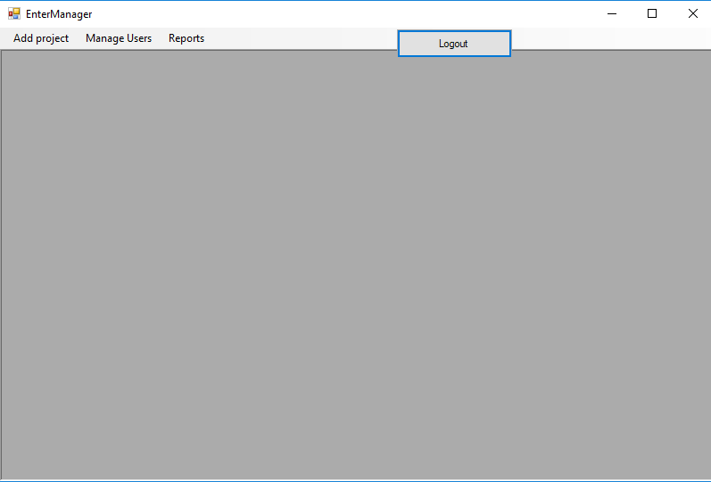   
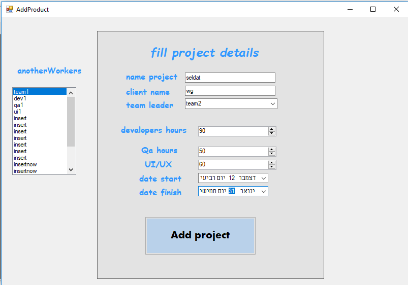 
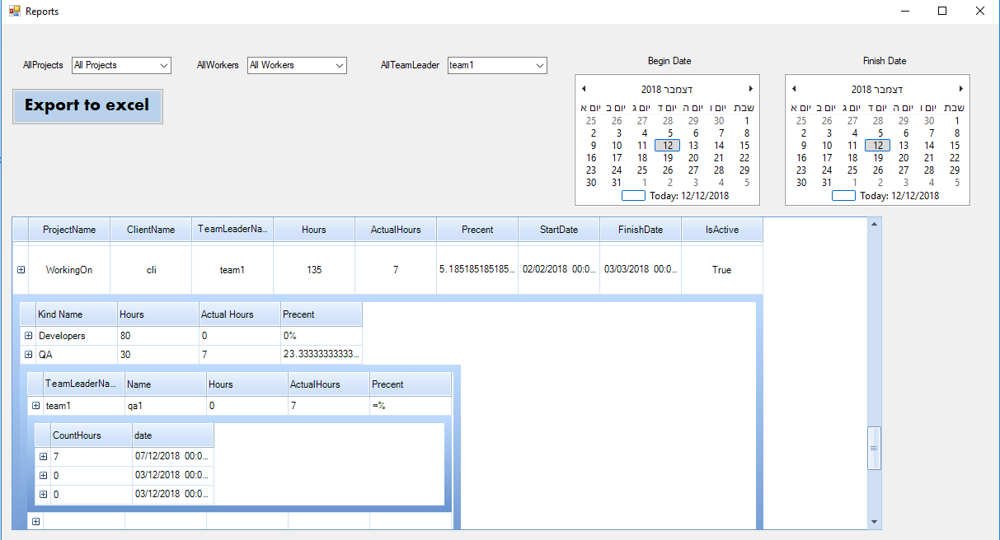   
  #### Users managment:  
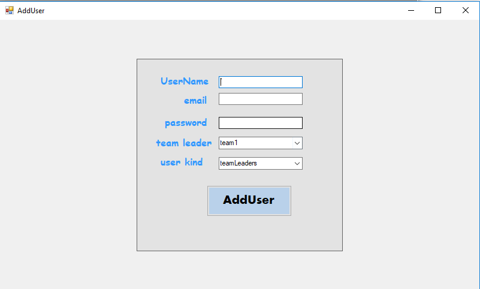   
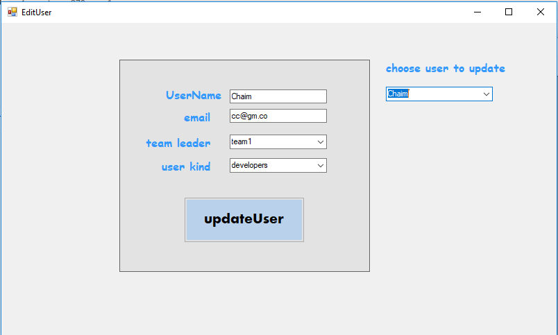   
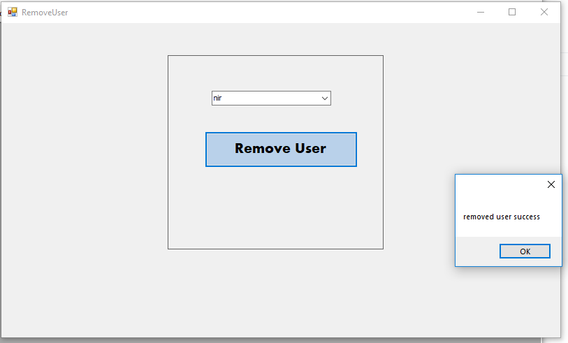   
### Teamleader screenshots:
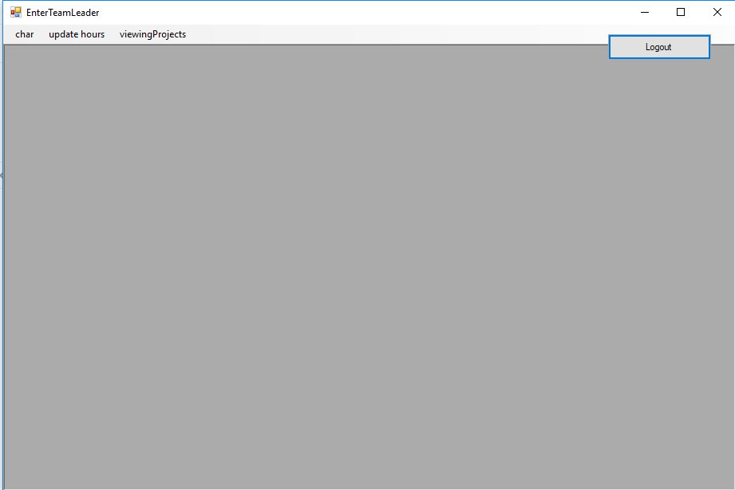   
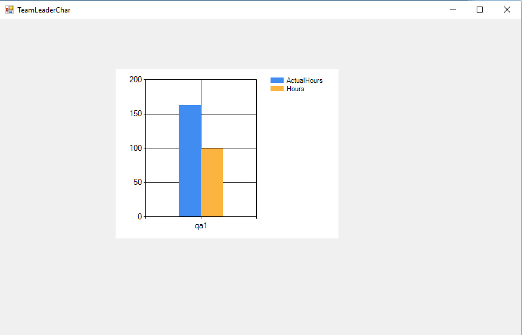   
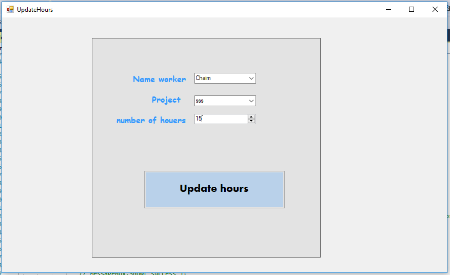   
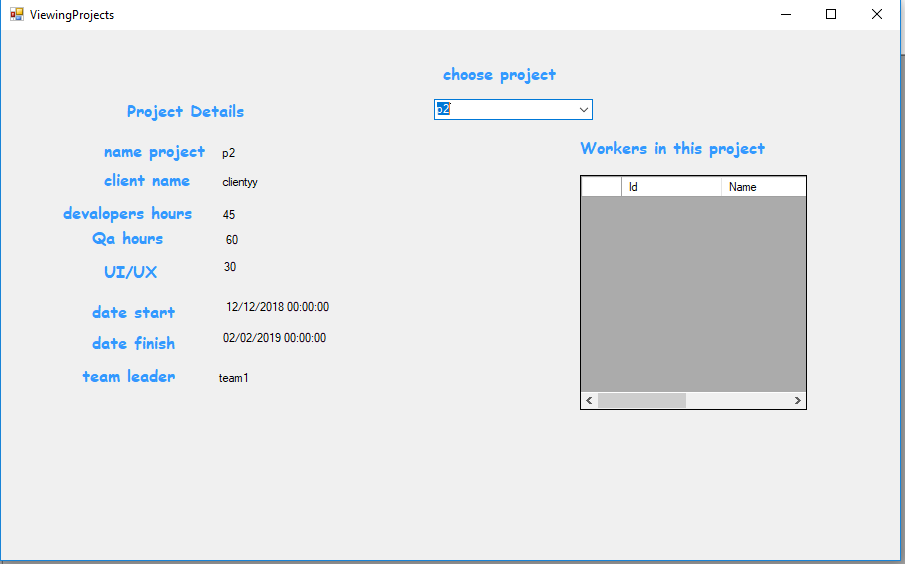  

### Worker screenshots:
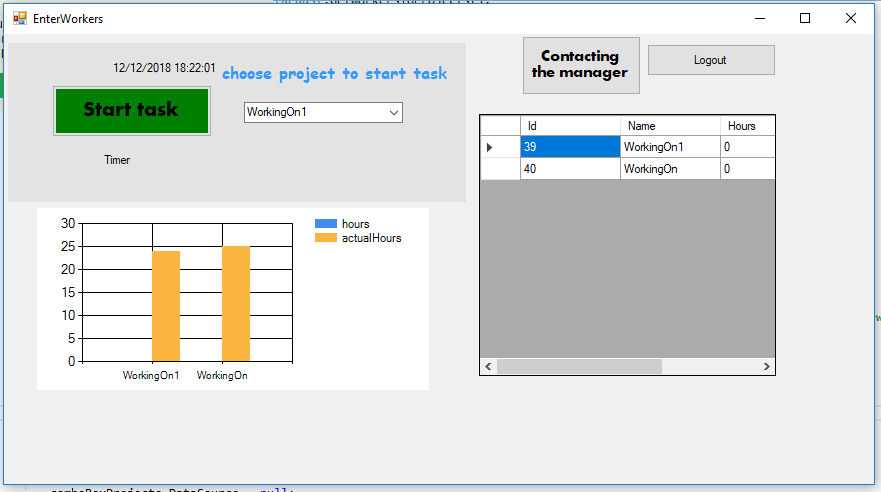   
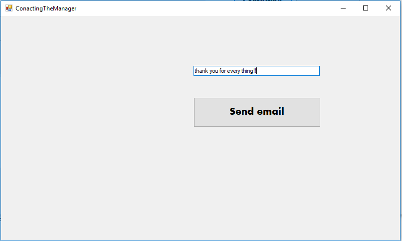   
